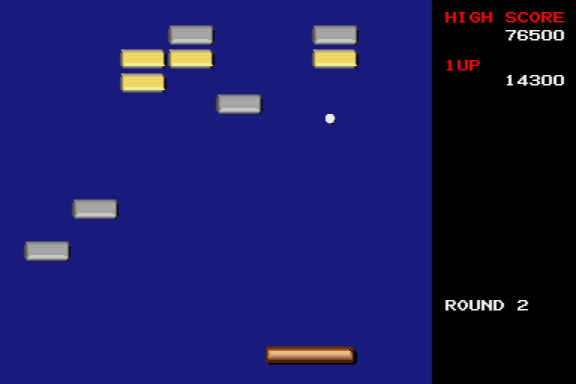
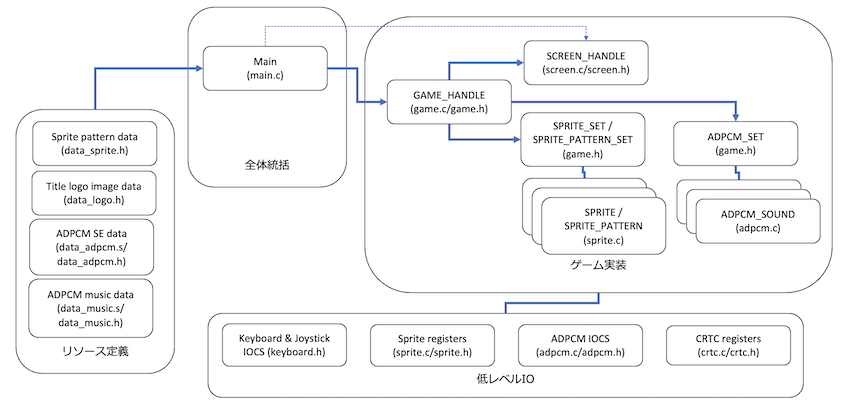
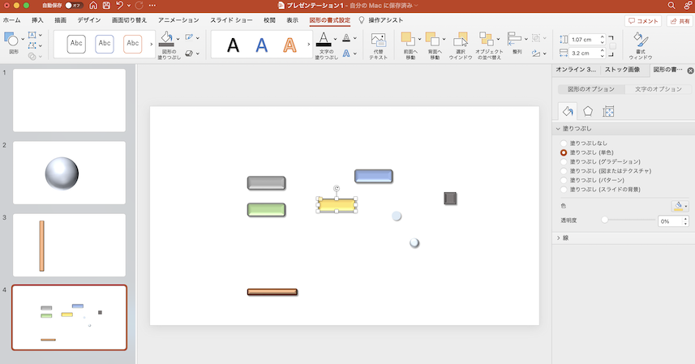

# PPT Breaker for X680x0

A breakout clone powered by PPTX for X680x0

---

## About This

ブロック崩しもどきのゲームです。ゲーム制作素人が X680x0 のプログラムを約30年ぶりにC言語で書いてみる練習として作ったものです。
なお実機を所有していないので、エミュレータ上でしか確認していません。

* xdev68k Cソースコード解説付
* 384x256画面モード
* 1/60 VSYNC 割込
* 画面スクロール
* ジョイスティック
* スプライトデザインにPowerPoint使用

動作報告・不具合報告歓迎

---

## 起動方法

PPTBKxxx.ZIP をダウンロードし展開して、PPTBREAK.X を実行します。

---

## 遊び方

ジョイスティックもしくはキーボードでパドルを左右に動かしてボールを落ちないように打ち返します。
1番上の段のブロックは2回当てないと消せません。
ラウンド3以降は一部のブロックが動く場合があります。ラウンド4が最終ステージです。

---

## 開発環境

* クロスコンパイル
  * [xdev68k](https://github.com/yosshin4004/xdev68k/) ([gcc 12.2.0に変更](https://github.com/tantanGH/distribution/blob/main/INSTALL_xdev68k_M1Mac.md)) Thanks to ファミべのよっしんさん
  * HAS060.X on run68mac Thanks to yunkさん / M.Kamadaさん / GOROmanさん
  * SHARP XC 2.1 ライブラリ & LK.X
  * Microsoft Visual Studio Code
  * Apple MacBook Air (2020, Apple Silicon, RAM8GB, SSD512GB)

* スプライトデータ作成
  * 透過PNG作成 Microsoft PowerPoint
  * データコンバート [png2sp](https://github.com/tantanGH/png2sp/)

* タイトルロゴデータ作成
  * [Cool Text](https://ja.cooltext.com/)
  * データコンバート [pngdeband](https://github.com/tantanGH/pngdeband/), [png2sp](https://github.com/tantanGH/png2sp/)

* サウンドデータ(SE)作成
  * [peko-step 効果音メーカー](https://www.peko-step.com/tool/soundeffect/)
  * データコンバート [wav2adpcm](https://github.com/tantanGH/wav2adpcm/)

* サウンドデータ(MUSIC)フリー素材
  * [DOVA-SYNDROME](https://dova-s.jp/) "Piece of a Dream" Thanks to FLASH☆BEATさん
  * データコンバート [wav2adpcm](https://github.com/tantanGH/wav2adpcm/)

* 動作確認
  * [XEiJ](https://stdkmd.net/xeij/) Thanks to M.Kamadaさん

---

## 動作デモ

---

## 設計と実装

これから X680x0 C言語ゲームプログラミングを再開したい、新たに始めたいという方に向けて、設計と実装について覚書を残しておきます。
ソースコードを読む際の参考にしてください。

ただし、素人が思い出しながら、あるいは新たに試行錯誤しながら作成したものですので、あくまで一例ということでお願いします。
アセンブラでカリカリに攻める実装とは対極で、ゆるく楽にをモットーにC言語での実装です。
オブジェクト指向的なデザインを取り入れて、なるべく保守性と安全性を高めるように気を遣ってあります。

ソースコードのコンパイルには xdev68k 環境が必須です。X680x0/Human68k 上の gcc/gcc2 コンパイラではコンパイルできません。
また、HLK301.X は run68上だと Out of memory が多発するので純正の LK.X を使っています。

---

### 全体デザイン

全体は大きく4つのブロックに分かれています。

1. 全体統括
2. ゲーム実装
3. 低レベルI/O
4. リソース定義

ブロックそれぞれについて簡単に解説します。

---

### 1. 全体統括

リソース定義情報を読み取り、必要なクラスインスタンス (SCREEN_HANDLE, SPRITE_PATTERN, SPRITE, ADPCM_SOUND) を作成します。スプライト、ADPCMについては、さらにそれらを束ねるSETインスタンス(SPRITE_SET, ADPCM_SET)を作成した後、ゲーム本体となる GAME_HANDLE インスタンスを作成します。

ゲームの実装そのものは GAME_HANDLE クラスが担っているので、main からは個々のイベントを流れに沿って呼び出す形になっています。最初と最後だけ SCREEN_HANDLE クラスインスタンスを直接使って画面の初期化と戻しもおこなっています。

---

### 2. ゲーム実装

各イベント (オープニング、エンディング、ラウンド開始、ラウンドクリア、ゲームオーバー等) とゲームループの実装です。VSYNC割り込みはゲームループの中だけで使うようにし、それ以外のイベントは必要に応じてVSYNC待ちをメインスレッド内でやる形としています。

---

### 3. 低レベルIO

CRTCレジスタを操作し、384x256正方形ピクセルモードを使用しています。スプライトについてはIOCSコールはオーバーヘッドが大きいので直接レジスタにアクセスしています。ADPCM、キーボード、ジョイスティックはIOCSコールの利用だけです。

---

### 4. リソース定義

スプライトパターンにつていは、元となる透過PNGイメージをパワーポイントの図形作成機能で作成してあります。

これを自作のツール [png2sp](https://github.com/tantanGH/png2sp/) にてスプライトパターンおよびパレットデータに自動変換しています。
もっと凝ったデザインにするならドット単位で修正を入れるべきですが、今回は手抜きで特にそういったことはやっていません。

X680x0のスプライトは16色パレットとなっていますが、実際はパレット0番は透明色になりますので、使える色は15色＋透明色ということになります。
`png2sp` はそこは考慮してあり、RGBAのアルファチャンネルを見て、パレット0にする部分と1~15で色をつける部分を考慮してコンバートするようになっています。

オープニングのロゴイメージデータはフリーのロゴ作成サイトで透過PNGイメージを作成し、一度 [pngdeband](https://github.com/tantanGH/pngdeband/) を使って見栄えの補正処理を行いました。さらにこれを `png2sp` で65536色ビットマップデータにコンバートしてあります。
`-d (--dump)` オプションを使うことで、スプライトデータとしてではなく、GVRAMにそのまま書ける16bitのビットマップイメージの `unsigned short[]` 配列を出力することができます。

ADPCMのSE(効果音)については、フリーのSE作成サイトでWAVデータとして作成し、[wav2adpcm](https://github.com/tantanGH/wav2adpcm/) でADPCMデータに変換しました。この際に `*.pcm` ファイルにコンバートするのではなく、`-d (--dump)` オプションと`-a (--asm)` オプションを組み合わせて使ってアセンブラコード(`.dc.b`によるバイト定義のみ)を出力させています。というのも `-d` だけで `unsigned char[]` 配列として出力してしまうと、gccがそれを文字列リテラルと勘違いして変な最適化を試みてしまいます。その結果出力されるアセンブラコードに極端に長い行が含まれてしまうことがあり、HASでのアセンブルが通らなくなることがあります。これを防ぐためにここは直接アセンブラコードでの出力としました。

ADPCMの曲データ(エンディング用)は、フリーの素材サイトからMP3のものを使わせて貰いました。Mac上でWAVに変換した後、やはり`wav2adpcm`を使ってアセンブラコードにしてあります。今回ADPCMの再生はIOCSコールだけを使っています。1回でバッファリングできる(再生のためのIOCSコールで待ちが発生しない)最大サイズである64kバイトに抑えるため、`wav2adm`の `-t` オプションと `-e` オプションを使って曲の後半を少しだけ削り、フェードアウトする形にして変換を行いました。

なお、今回はFM音源のリソースは使いませんでした。

---