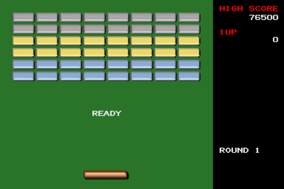
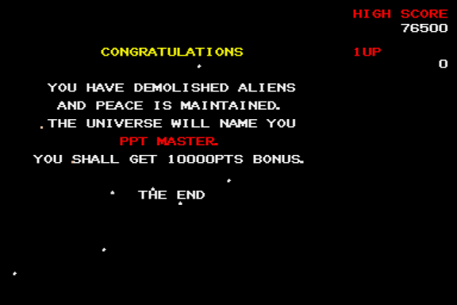

# PPT Breaker for X680x0

A breakout clone powered by PPTX for X680x0

---

## About This

これは X680x0 のアプリケーションをC言語で約30年ぶりに書いてみる練習として作ったブロック崩しもどきのゲームです。
エミュレータ上でしか確認していませんが、一応10MHz機でも大丈夫にしたつもりです。

---

## 起動方法

PPTBRKxxx.ZIP をダウンロードし展開して、PPTBREAK.X を実行します。

---

## 遊び方

ジョイスティックもしくはキーボードでパドルを左右に動かしてボールを落ちないように打ち返します。

---

## 開発環境

* クロスコンパイル
  * [xdev68k](https://github.com/yosshin4004/xdev68k/) ([gcc 12.2.0に変更](https://github.com/tantanGH/distribution/blob/main/INSTALL_xdev68k_M1Mac.md))
  * XC 2.1 ライブラリ
  * Microsoft Visual Code Studio
  * MacBoor Air (2020, Apple Silicon, RAM8GB, SSD512GB)

* スプライトデータ作成
  * 透過PNG作成 Microsoft PowerPoint
  * データコンバート [png2sp](https://github.com/tantanGH/png2sp/)

* タイトルロゴデータ作成
  * [Cool Text](https://ja.cooltext.com/)
  * データコンバート [pngdeband](https://github.com/tantanGH/pngdeband/), [png2sp](https://github.com/tantanGH/png2sp/)

* サウンドデータ(SE)作成
  * [peko-step 効果音メーカー](https://www.peko-step.com/tool/soundeffect/)
  * データコンバート [wav2adpcm](https://github.com/tantanGH/wav2adpcm/)

* サウンドデータ(MUSIC)無料素材利用
  * [DOVA-SYNDROME](https://dova-s.jp/)
  * データコンバート [wav2adpcm](https://github.com/tantanGH/wav2adpcm/)

* 動作確認
  * [XEiJ](https://stdkmd.net/xeij/)

ソースコードのコンパイルには xdev68k 環境が必須です。X680x0/Human68k 上の gcc/gcc2 コンパイラではコンパイルできません。

---

## 動作デモ

